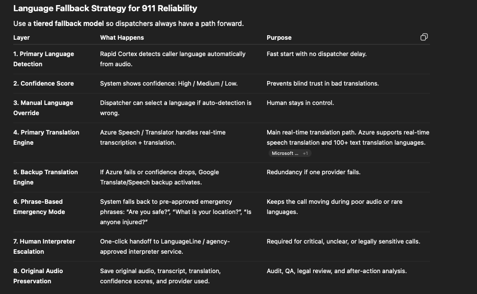
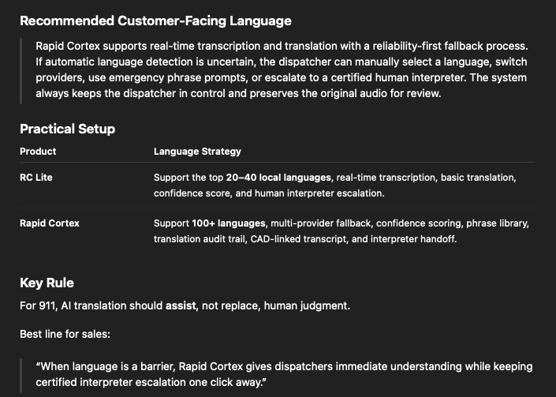

# Language fallback strategy for 911 reliability

Use a **tiered fallback model** so dispatchers always have a path forward. This page captures the **operator-facing** language story (reliability-first, human-in-the-loop). For **configuration** of translation providers and language codes, see [`supported-call-languages.md`](./supported-call-languages.md).

**Reference visuals (same content as tables below):**

| Layer | What happens | Purpose |
| --- | --- | --- |
| **1. Primary language detection** | Rapid Cortex detects caller language automatically from audio. | Fast start with no dispatcher delay. |
| **2. Confidence score** | System shows confidence: High / Medium / Low. | Prevents blind trust in bad translations. |
| **3. Manual language override** | Dispatcher can select a language if auto-detection is wrong. | Human stays in control. |
| **4. Primary translation engine** | **Azure Speech / Translator** handles real-time transcription + translation. | Main real-time translation path. Azure supports real-time speech translation and **100+ text translation** languages. |
| **5. Backup translation engine** | If Azure fails or confidence drops, **Google Translate / Speech** backup activates. | Redundancy if one provider fails. |
| **6. Phrase-based emergency mode** | System falls back to pre-approved emergency phrases: *“Are you safe?”*, *“What is your location?”*, *“Is anyone injured?”* | Keeps the call moving during poor audio or rare languages. |
| **7. Human interpreter escalation** | One-click handoff to LanguageLine / agency-approved interpreter service. | Required for critical, unclear, or legally sensitive calls. |
| **8. Original audio preservation** | Save original audio, transcript, translation, confidence scores, and **provider used**. | Audit, QA, legal review, and after-action analysis. |

**Provider order (product intent):** **Azure** as primary (Layer 4), **Google** as backup (Layer 5). Backup may apply on **failure** or when **confidence drops** below policy thresholds.

---

## Recommended customer-facing language (summary)

- Supports **real-time transcription and translation** with a **reliability-first fallback process**.  
- Dispatchers can **manually select** a language, **switch providers**, use **emergency phrase prompts**, and **escalate** to a certified human interpreter.  
- Dispatcher remains in control; **original audio** is preserved for review.

| Product | Language strategy |
| --- | --- |
| **RC Lite** | Support the top **20–40 local languages**, real-time transcription, basic translation, confidence score, and human interpreter escalation. |
| **Rapid Cortex** | Support **100+ languages**, multi-provider fallback, confidence scoring, phrase library, translation audit trail, CAD-linked transcript, and interpreter handoff. |

**Key rule:** For 911, AI translation should **assist**, not replace, human judgment.

**Positioning line:** *“When language is a barrier, Rapid Cortex gives dispatchers immediate understanding while keeping certified interpreter escalation one click away.”*

---

## Engineering alignment (current codebase)

So documentation stays accurate next to implementation:

- **Text translation (silent text, tools, many API paths):** **Azure Translator** is primary; **Google Translate** is fallback (`TRANSLATION_PRIMARY_PROVIDER` / `TRANSLATION_FALLBACK_PROVIDER`). **100+** language **codes** are supported in the registry where providers advertise coverage — not every code implies live **speech** STT/TTS for that language.  
- **Live call / chunk pipeline (STT + x→English translation tiers):** Controlled separately by `PRIMARY_STT_PROVIDER`, `PRIMARY_TRANSLATION_PROVIDER`, and related env vars — providers may include Azure, Google, AWS, or mocks depending on deployment. Layer 4/5 in the table above describes the **intended production posture** when those tiers are configured accordingly.  
- **Confidence, phrase library, interpreter escalation, full audit fields:** Vary by feature flag and agency workflow; preserve Layer 8 intent (**provider used**, transcripts, originals) wherever logging and retention policies are enabled.

When customer contracts require a strict reading of “Azure primary / Google backup” for **all** translation-bearing paths, align **both** text orchestration and **voice translation chain** env vars with that posture and attach evidence per [`customer-readiness-gate.md`](../customer-readiness-gate.md) (e.g. G3).
