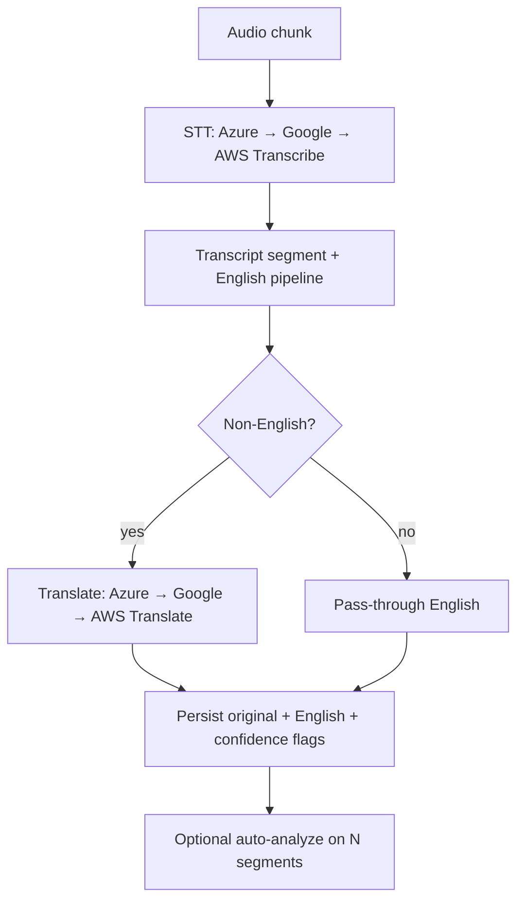

# Multilingual call pipeline

Rapid Cortex models a **911-style call** as an **incident** (v1: `callId` ≈ `incidentId`). Production multilingual processing uses a **fixed vendor stack** with deterministic fallbacks:

| Tier | Speech-to-text | Text language ID | Translation to English |
| --- | --- | --- | --- |
| Primary | **Azure Speech** (short-phrase REST) | **Azure Translator** detect | **Azure Translator** |
| Secondary | **Google Cloud Speech-to-Text** (v1 `speech:recognize`) | **Google Translate** v2 detect | **Google Translate** v2 |
| Tertiary | **AWS Transcribe** (batch job + S3 staging; IAM-only) | **Amazon Comprehend** | **Amazon Translate** |

Orchestrators apply **`PROVIDER_REQUEST_TIMEOUT_MS`**, per-provider **retries with jittered backoff**, and optional **tier fallbacks** (`PROVIDER_ENABLE_FALLBACKS`). Failures raise **`VoiceProviderError`** with stable **`code`** values (for example `STT_ALL_PROVIDERS_FAILED`); the audio-chunk HTTP handler returns **503** with JSON `{ error, code, retryable }`.

**Amazon Transcribe** options (language identification pool, timeouts, metrics): [AWS_TRANSCRIBE_CONFIGURATION.md](./AWS_TRANSCRIBE_CONFIGURATION.md).

## HTTP flow

1. **Language session** — `POST /api/incidents/{id}/language-session/start` creates **`LanguageSessionsTable`** (Dynamo) with optional `preferredLanguageHint`.
2. **Audio chunks (near real-time)** — `POST /api/incidents/{id}/audio-chunks` accepts **base64** audio, monotonic **`sequence`** (ordering), and `format` (`pcm16le` | `wav` | `webm` | `opaque`). Chunks run **STT chain → transcript segment → English pipeline** (translation when needed). Persisted **`text` is English** for the existing AI analysis path; **`originalTranscript`** keeps source-language text and metadata.
3. **Text-first path** — `POST /api/incidents/{id}/transcript` with **`originalTranscript`** runs **language detection** (when unknown) and **translation** so stored `text` stays English.
4. **Session status** — `GET /api/incidents/{id}/language-session/status`.
5. **Finalize** — `POST /api/incidents/{id}/language-session/finalize`.

## Flow (mermaid)

## Idempotency (audio chunks)

- **Ordering:** DynamoDB conditional update on `LanguageCallSession.lastChunkSequence` ensures **strictly increasing** `sequence` values for new work (`tryAdvanceChunkSequence`).
- **Safe replay:** If the client **retries the same `sequence`** after a successful write (e.g. network timeout), the session stores **`lastChunkSegmentId`**. The service returns **HTTP 200** with the **existing** `TranscriptSegment` and metadata flags — **no duplicate STT** and **no duplicate transcript row**.
- **Out-of-order / duplicate advance:** Still returns **409** `DUPLICATE_OR_OUT_OF_ORDER_CHUNK` when the conditional update fails and the replay shortcut does not apply.

## Supported languages (v1 top 10)

**`SUPPORTED_CALL_LANGUAGES`** (comma list). Default: **en, es, zh, tl, vi, ar, fr, ko, ru, pt**.

- **`zh`**: single routing bucket; **Mandarin is the default STT/translate dialect** (`zh-CN` / `cmn-Hans-CN` style locales). **Cantonese (`yue-*`)** is normalized into the same `zh` bucket for allowlisting and review—**operator-assisted interpretation** may still be required for reliable Cantonese capture.
- **`tl`**: normalized from **`fil`** where providers return Filipino/Tagalog codes.

## Confidence, safety, audit

- Thresholds: **`LANGUAGE_DETECTION_MIN_CONFIDENCE`**, **`STT_MIN_CONFIDENCE`**, **`TRANSLATION_MIN_CONFIDENCE`**.
- Segments may set **`lowConfidence`** / **`needsInterpreterReview`**; sessions inherit **`needsInterpreterReview`** when STT or language detection is weak.
- Audits: **`voice.language.detected`**, **`voice.translation.applied`**, **`voice.pipeline.failed`** (STT chain exhaustion), plus existing transcript append events.

## Production pilot checklist

- [ ] **`LANGUAGE_SESSIONS_TABLE`** and **`ASSETS_BUCKET`** set (AWS Transcribe path requires S3 staging).
- [ ] **`MULTILINGUAL_STRICT_VALIDATION=true`** (staging/pilot/prod in SAM).
- [ ] Secrets populated for **Azure**, **Google**, and **AWS** tiers you enable (see [DEPLOYMENT_MULTILINGUAL_AWS.md](./DEPLOYMENT_MULTILINGUAL_AWS.md)).
- [ ] **`PRIMARY_*` = Azure**, **`SECONDARY_*` = Google**, **`TERTIARY_*` = AWS** (or your approved order) via env / SAM mappings.
- [ ] CloudWatch alarms for **`PostIncidentAudioChunk*`** reviewed ([infra/monitoring-and-ops.md](../infra/monitoring-and-ops.md)).
- [ ] English transcript feeds analysis: **`AUTO_FEED_TRANSLATED_TRANSCRIPTS_TO_ANALYSIS`** + segment cadence (`AUTO_ANALYZE_EVERY_N_SEGMENTS`) aligned with ops.

## Related docs

- [LANGUAGE_TRANSLATION_CONFIGURATION.md](./LANGUAGE_TRANSLATION_CONFIGURATION.md)
- [RUNBOOK_MULTILINGUAL_CALLS.md](./RUNBOOK_MULTILINGUAL_CALLS.md)
- [SECURITY_MODEL.md](./SECURITY_MODEL.md)
