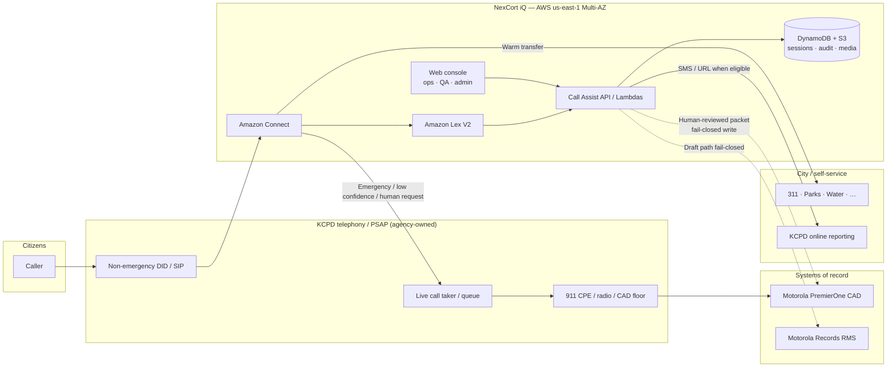
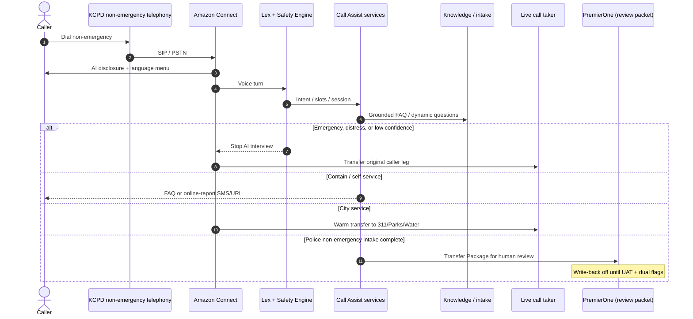
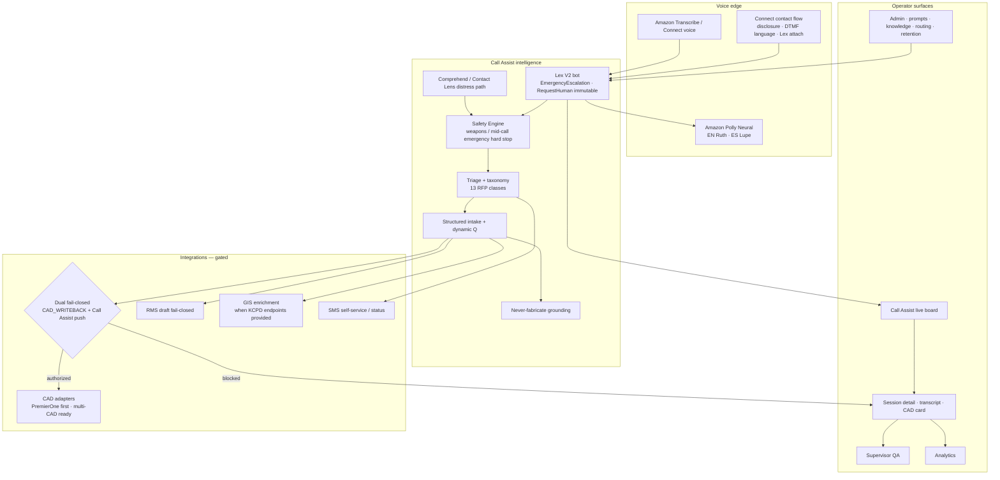
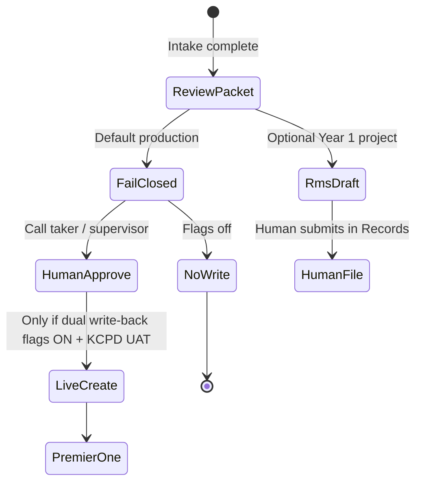

# NexCort iQ Call Assist — Architecture Overview  
## Kansas City Missouri Police Department  
### RFP 2026-0010 Addendum 4 — Attachment

**Offeror:** Apps on Demand LLC d/b/a NexCort iQ  
**Scope:** AI-assisted **non-emergency** call management  
**Not in this diagram:** 911 CPE replacement · RapidSOS (removed per Q&A) · autonomous CAD dispatch

Use the diagrams below in the proposal (export to PNG/PDF). Narrative text may be copied into a cover page.

---

## 1. One-paragraph summary

Citizens dial KCPD’s **designated non-emergency** number. KCPD telephony (SIP/PSTN) delivers the call into **Amazon Connect**, which runs a Call Assist contact flow (language menu, AI disclosure, Lex bot). **Amazon Lex** plus NexCort iQ safety/intake services perform conversational triage. Outcomes are: **contain** (self-service / FAQ), **warm-transfer** to city services (311 / Parks / Water), or **immediate transfer** to a live call taker when emergency, distress, or low confidence is detected. Supervisors use the NexCort iQ web console for QA and analytics. **Motorola PremierOne** remains the CAD system of record; incident packets are human-reviewed and **fail-closed** until KCPD authorizes write-back.

---

## 2. Context diagram (agency view)



**Boundary note:** Everything left of Connect (DIDs, CPE, queues overflow into 911) stays with KCPD. NexCort iQ owns the AI front-end, session data, and consoles on AWS.

---

## 3. Call path (happy path + escalate)



---

## 4. Logical component view



---

## 5. Trust zones & data flow

| Zone | Components | Data |
|------|------------|------|
| **Agency edge** | Non-emergency DID, SIP to Connect, live queues | ANI/ALI/Caller ID when signaling provides them |
| **AWS application** | Connect, Lex, Lambda APIs, Cognito MFA console | Session, transcript, intake, audit (`agencyId`-scoped) |
| **Data at rest** | DynamoDB, S3 | Encryption at rest; TLS in transit |
| **Systems of record** | PremierOne, Records | Only after human review / UAT; write paths fail-closed by default |
| **Subprocessors** | AWS Connect, Lex, Transcribe, Polly, Translate, Bedrock (as configured), Comprehend | Listed in proposal subprocessors attachment |

**CJIS posture:** CJIS-**aligned** controls (MFA, encryption, RBAC, audit). Not an FBI CJIS ATO issued to NexCort iQ. RapidSOS is **not** on this non-emergency path.

---

## 6. CAD / RMS posture (proposal honesty)



---

## 7. How to attach

1. Export §2 (context) and §3 (sequence) as **two PNG figures** for the proposal body.  
2. Keep §4–§6 as an appendix if page count allows.  
3. Caption suggestion:

> **Figure A.** NexCort iQ Call Assist attaches to KCPD’s non-emergency telephony via Amazon Connect. AI triage runs in AWS; emergencies transfer to live call takers; CAD remains system of record with fail-closed write-back.

**Render tip (from repo root):**

```bash
# requires @mermaid-js/mermaid-cli
npx @mermaid-js/mermaid-cli -i docs/rfp/kcpd-2026-0010/diagrams/01-context.mmd -o docs/rfp/kcpd-2026-0010/diagrams/01-context.png -b white
```

Standalone `.mmd` files for export are in `diagrams/` beside this document.

---

## Version

| Date | Notes |
|------|-------|
| 2026-09-27 | Initial KCPD proposal architecture attachment |
